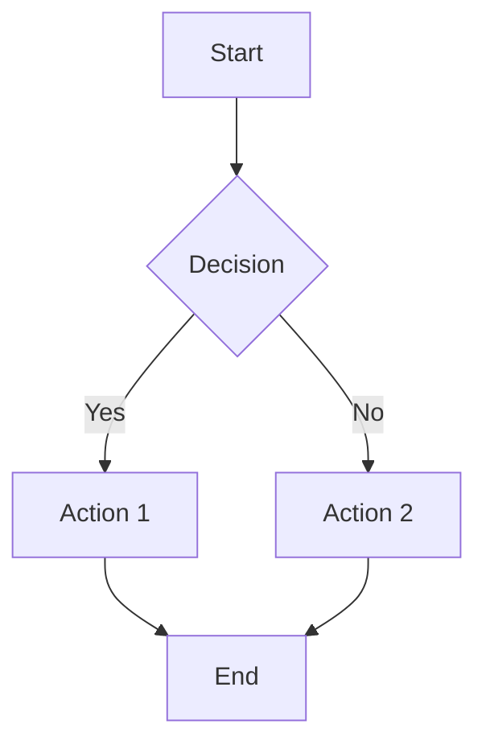
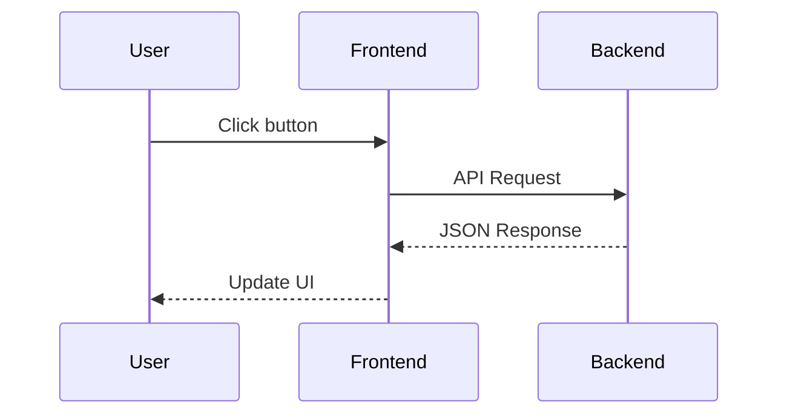

# Markdown Guide

Learn all the formatting syntax supported by Kokobrain's editor.

## What is Markdown?

Markdown is a simple way to format text using plain characters. Instead of clicking toolbar buttons like in a word processor, you type lightweight symbols — like `**bold**` or `# Heading` — and Kokobrain renders them visually in live preview mode.

The best part: your `.md` files are just plain text files. They're perfectly readable even outside of Kokobrain, in any text editor. You'll never be locked into a proprietary format.

You don't need to memorize everything on this page at once. Start with **bold**, *italic*, and headings. As you get comfortable, come back to learn more syntax. The [Command Palette](06-command-palette.md) can also help you insert formatting without remembering the exact syntax.

---

## Basic Formatting

| What you want    | What you type              | Result                   |
|------------------|----------------------------|--------------------------|
| Bold             | `**bold text**`            | **bold text**            |
| Italic           | `*italic text*`            | *italic text*            |
| Bold + Italic    | `***bold and italic***`    | ***bold and italic***    |
| Strikethrough    | `~~strikethrough~~`        | ~~strikethrough~~        |
| Highlight        | `==highlighted text==`     | ==highlighted text==     |
| Inline code      | `` `code` ``               | `code`                   |

> [!TIP]
> Highlight (`==text==`) renders with a yellow background in live preview — great for marking key phrases you want to revisit.

---

## Headings

Headings create structure in your notes. Start a line with one or more `#` symbols followed by a space:

```
# Heading 1
## Heading 2
### Heading 3
#### Heading 4
##### Heading 5
###### Heading 6
```

- `# Heading 1` is the largest and is typically used as the note title
- `###### Heading 6` is the smallest
- Each additional `#` creates a deeper level of nesting

Headings are more than just big text — they define the structure of your document:

- They appear in the **Outline** panel in the right sidebar, giving you a clickable table of contents
- You can link directly to a heading in another note using wikilinks: `[[note#Heading]]`
- The outline updates automatically as you add or rename headings

---

## Lists

### Unordered Lists

Use `-`, `*`, or `+` at the start of a line. Indent with a tab to create nested items:

```
- Item one
- Item two
	- Nested item (indent with tab)
		- Deeper nesting
- Item three
```

### Ordered Lists

Use numbers followed by a period. The actual numbers don't matter — Kokobrain renumbers them automatically:

```
1. First
2. Second
3. Third
```

### Mixed Lists

You can combine ordered and unordered lists by nesting one inside the other:

```
1. Step one
	- Detail A
	- Detail B
2. Step two
	- Detail C
3. Step three
```

---

## Task Lists (Checkboxes)

Task lists are regular list items with a checkbox at the start:

```
- [ ] Todo item
- [x] Completed item
- [/] In progress
- [-] Cancelled
```

In live preview mode, you can **click the checkbox** to toggle its state — no need to edit the raw text.

Tasks are collected automatically by the **Tasks View**, which gives you a unified list of all tasks across your vault. You can also sync them with external task managers. See [Tasks & Todoist](10-tasks-and-todoist.md) for details.

---

## External Links

Wrap the link text in square brackets and the URL in parentheses:

```
[Link text](https://example.com)
```

This renders as a clickable link: [Link text](https://example.com)

When clicked, external links open in your default browser.

### Link with title

Add a title in quotes after the URL — it appears as a tooltip on hover:

```
[Link with tooltip](https://example.com "Tooltip title")
```

### Reference-style links

Define URLs separately to keep your text readable:

```
Check out [this article][ref1] and [that guide][ref2].

[ref1]: https://example.com
[ref2]: https://example.org "Guide title"
```

The definition lines (`[ref]: url`) are dimmed in live preview.

### Autolinks

Wrap a URL or email in angle brackets for a quick link:

```
<https://www.google.com>
<user@example.com>
```

### Bare URL detection

Plain URLs starting with `https://` are automatically detected and rendered as clickable links — no special syntax needed:

```
Visit https://www.google.com for more info.
```

> [!TIP]
> For linking between notes inside your vault, use wikilinks instead — see [Wikilinks & References](05-wikilinks.md).

---

## Images

Use the same syntax as links, but with an exclamation mark `!` at the start:

```

```

- Use a **relative path** from the vault root for images stored inside your vault
- Example: `` for an image located at `<vault>/assets/photo.jpg`
- The alt text inside the square brackets is displayed if the image can't be loaded

### Image sizing

Control the display size using the pipe syntax in the alt text:

```
          Width only (300px)
      Width and height (300x200px)
```

This syntax works for both standard images and wikilink embeds (`![[image.png|300]]`).

### Reference-style images

Like reference-style links, you can define the URL separately:

```
![Screenshot][img-ref]

[img-ref]: assets/screenshot.png
```

> [!TIP]
> Create an `assets/` or `attachments/` folder in your vault to keep images organized separately from your notes.

---

## Blockquotes

Start a line with `>` followed by a space:

```
> This is a quote.
> It can span multiple lines.
>
> > Nested quotes work too.
```

This renders as:

> This is a quote.
> It can span multiple lines.
>
> > Nested quotes work too.

---

## Callouts

Callouts are special blockquotes that highlight important information with an icon and colored border. They use Obsidian-compatible syntax:

```
> [!NOTE]
> This is an informational note.

> [!TIP]
> A helpful tip for the reader.

> [!WARNING]
> Something to be careful about.

> [!IMPORTANT]
> Critical information that should not be missed.

> [!CAUTION]
> Potential negative consequences of an action.
```

Each callout type has its own color and icon, making it easy to scan a document for important information at a glance.

### All Available Callout Types

| Type         | Use for                                      |
|--------------|----------------------------------------------|
| `NOTE`       | General information or context               |
| `INFO`       | Additional details or context                |
| `TIP`        | Helpful advice or best practices             |
| `IMPORTANT`  | Critical information the reader must know    |
| `WARNING`    | Potential problems or things to watch out for|
| `DANGER`     | Hazardous or destructive actions             |
| `CAUTION`    | Serious negative consequences                |
| `QUOTE`      | Attributed quotations                        |
| `EXAMPLE`    | Illustrative examples                        |
| `BUG`        | Known bugs or issues                         |
| `SUCCESS`    | Positive outcomes or confirmations           |
| `FAILURE`    | Negative outcomes or errors                  |
| `QUESTION`   | Open questions or things to investigate      |
| `ABSTRACT`   | Summaries or overviews                       |

If you omit the title text (e.g. `> [!NOTE]` with nothing after the type), the callout type is used as the default title.

### Collapsible callouts

Add `+` or `-` after the type to make a callout foldable. Click the chevron to expand or collapse:

```
> [!NOTE]+ Starts expanded — click to collapse
> This content is visible by default.

> [!WARNING]- Starts collapsed — click to expand
> This content is hidden by default.
```

- `+` — starts **expanded**, can be collapsed
- `-` — starts **collapsed**, can be expanded

### Multi-paragraph callouts

Continue a callout across multiple paragraphs by keeping the `>` prefix on blank lines:

```
> [!INFO] Long callout
> First paragraph of the callout.
>
> Second paragraph — still inside the same callout.
>
> Third paragraph.
```


---

## Tables

Create tables using pipes `|` and dashes `-`:

```
| Column 1 | Column 2 | Column 3 |
|----------|----------|----------|
| Row 1    | Data     | Data     |
| Row 2    | Data     | Data     |
```

This renders as a formatted table with borders and proper alignment.

### Column Alignment

Control text alignment within columns using colons `:` in the separator row:

```
| Left-aligned | Centered    | Right-aligned |
|:-------------|:-----------:|--------------:|
| Text         | Text        | Text          |
| More text    | More text   | More text     |
```

- `|:---|` — left-aligned (default)
- `|:---:|` — centered
- `|---:|` — right-aligned

> [!TIP]
> You don't need to perfectly align the pipes in source mode. Kokobrain will render the table correctly as long as the structure is valid.

---

## Code Blocks

### Inline Code

Wrap text in single backticks for inline code:

```
Use the `console.log()` function to debug.
```

This renders as: Use the `console.log()` function to debug.

### Fenced Code Blocks

Use triple backticks for multi-line code blocks. Specify the language after the opening backticks to enable syntax highlighting:

````
```javascript
function hello() {
	console.log("Hello, world!");
}
```
````

````
```python
def greet(name):
    return f"Hello, {name}!"
```
````

````
```rust
fn main() {
    println!("Hello from Rust!");
}
````

Supported languages include: `javascript`, `typescript`, `python`, `rust`, `html`, `css`, `json`, `yaml`, `bash`, `sql`, `go`, `java`, `c`, `cpp`, `swift`, `ruby`, `php`, `markdown`, and many more.

> [!TIP]
> If you omit the language name, the code block still renders with a monospace font — it just won't have syntax highlighting.

---

## Horizontal Rule

Type three or more dashes on their own line to create a visual separator:

```
---
```

This draws a horizontal line across the width of the editor, useful for separating sections within a note.

---

## Math (KaTeX)

Kokobrain supports mathematical notation using KaTeX syntax.

### Inline Math

Wrap a formula in single dollar signs to render it inline with your text:

```
The formula $E = mc^2$ changed physics forever.
```

This renders as: The formula $E = mc^2$ changed physics forever.

### Block Math

Use double dollar signs for standalone equations centered on their own line:

```
$$
\int_0^\infty e^{-x^2} dx = \frac{\sqrt{\pi}}{2}
$$
```

More examples:

```
$$
f(x) = \sum_{n=0}^{\infty} \frac{f^{(n)}(a)}{n!}(x - a)^n
$$
```

### Matrices

```
$$
\begin{pmatrix} a & b \\ c & d \end{pmatrix}
$$
```

Use `pmatrix` for parentheses, `bmatrix` for square brackets.

### Aligned equations

Use `\begin{aligned}` to align multi-line equations at the `&` symbol:

```
$$
\begin{aligned}
f(x) &= x^2 + 2x + 1 \\
&= (x + 1)^2
\end{aligned}
$$
```

### Systems of equations

Use `\begin{cases}` for systems with a brace on the left:

```
$$
\begin{cases}
x + y = 10 \\
2x - y = 5
\end{cases}
$$
```

### Common symbols

| Category | Symbols |
|----------|---------|
| Greek lowercase | `\alpha`, `\beta`, `\gamma`, `\delta`, `\epsilon`, `\theta`, `\lambda`, `\mu`, `\sigma`, `\omega` |
| Greek uppercase | `\Gamma`, `\Delta`, `\Theta`, `\Lambda`, `\Sigma`, `\Omega` |
| Operators | `\pm`, `\times`, `\div`, `\neq`, `\leq`, `\geq`, `\approx`, `\equiv` |
| Arrows | `\rightarrow`, `\leftarrow`, `\Rightarrow`, `\Leftarrow`, `\leftrightarrow` |

> [!TIP]
> A standalone `$` followed by text (like `$100`) is **not** interpreted as math — the parser requires a matching closing `$` with a formula inside.

> [!NOTE]
> Math rendering uses KaTeX syntax. For the full list of supported symbols, functions, and environments, see the [KaTeX documentation](https://katex.org/docs/supported.html).

---

## Footnotes

Footnotes let you add references without cluttering the main text.

### Standard footnotes

Add a reference in the text with `[^id]`, then define it anywhere in the note:

```
This claim needs a source[^1], and so does this one[^second].

[^1]: Source for the first claim.
[^second]: Source for the second claim.
```

The reference renders as a superscript number. The definition line is styled with a bold marker.

### Multi-line footnotes

Indent continuation lines with 4 spaces to keep them as part of the same footnote:

```
[^long]: First line of the footnote.
    Second line (indented with 4 spaces).
    Third line.
```

### Inline footnotes

For quick notes, define the footnote right in the text:

```
This has an inline footnote^[defined right here in the text].
```

---

## Comments

Use Obsidian-style `%%` markers to add comments that are hidden in preview:

### Inline comments

```
Visible text %%hidden comment%% more visible text.
```

When the cursor is **outside** the comment, it is completely hidden. When the cursor is **inside**, the comment appears dimmed with the `%%` markers visible.

### Block comments

Wrap multiple lines in `%%` markers:

```
%%
This entire block is hidden in preview.
Multiple lines of notes to self.
%%
```

Comments are useful for leaving notes to yourself, TODOs, or test instructions that readers should not see.

---

## Hard Line Breaks

By default, a single line break in source mode does not create a visual break in preview — the text flows continuously. To force a line break within the same paragraph:

### Trailing spaces

End a line with **two or more spaces**:

```
First line with two spaces at the end.··
Second line (same paragraph, but on a new line).
```

### Backslash

End a line with a backslash `\`:

```
First line with backslash.\
Second line.
```

Both methods produce a `<br>` — a line break without starting a new paragraph. A blank line between text creates a new paragraph with vertical spacing.

---

## Mermaid Diagrams

Kokobrain supports Mermaid diagrams inside fenced code blocks. Specify `mermaid` as the language:

### Flowcharts

````

````

Use `graph TD` for top-down or `graph LR` for left-to-right.

### Sequence diagrams

````

````

### Other diagram types

Mermaid also supports: `classDiagram`, `stateDiagram-v2`, `pie`, and more. See the [Mermaid documentation](https://mermaid.js.org/intro/) for the full list.

Syntax errors in Mermaid blocks display an error message inline — the editor never crashes.

---

## Frontmatter (YAML Metadata)

You can add structured metadata to any note by placing a YAML block at the very top of the file, enclosed between `---` delimiters:

```yaml
---
title: My Note
tags: [project, important]
date: 2026-02-17
status: draft
priority: high
---

Your note content starts here.
```

### How Frontmatter Works

- The `---` block **must** be the very first thing in the file — no blank lines before it
- Frontmatter is parsed automatically and displayed in the **Properties** panel in the right sidebar
- In live preview, frontmatter is shown as a clean property table rather than raw YAML

### Common Fields

| Field      | Purpose                                           | Example                     |
|------------|---------------------------------------------------|-----------------------------|
| `title`    | Display name for the note                         | `title: Meeting Notes`      |
| `tags`     | Categorize notes (also feeds the Tags panel)      | `tags: [work, meeting]`     |
| `date`     | Date associated with the note                     | `date: 2026-02-17`          |
| `aliases`  | Alternative names for wikilink resolution         | `aliases: [MN, meetings]`   |
| `cssclass` | Apply a custom CSS class to the note              | `cssclass: wide-page`       |

You can add **any custom fields** you want — they all become visible in the Properties panel and queryable in Collection.

> [!TIP]
> You don't have to type frontmatter by hand. Use the **Properties** panel in the right sidebar to add and edit fields visually. See [Sidebar Panels](07-sidebar-panels.md) for details.

---

## Quick Reference Card

Here's a compact cheat sheet of the most commonly used syntax:

| Syntax                          | Result                          |
|---------------------------------|---------------------------------|
| `**bold**`                      | **bold**                        |
| `*italic*`                      | *italic*                        |
| `~~strikethrough~~`             | ~~strikethrough~~               |
| `==highlight==`                 | ==highlight==                   |
| `` `inline code` ``             | `inline code`                   |
| `# Heading`                     | Heading (level 1-6)             |
| `- item`                        | Bullet list                     |
| `1. item`                       | Numbered list                   |
| `- [ ] task`                    | Checkbox                        |
| `[text](url)`                   | External link                   |
| ``                  | Image                           |
| ``             | Image with width                |
| `> quote`                       | Blockquote                      |
| `> [!TYPE]`                     | Callout                         |
| `> [!TYPE]+` / `> [!TYPE]-`    | Collapsible callout             |
| `---`                           | Horizontal rule                 |
| `$formula$`                     | Inline math                     |
| `$$formula$$`                   | Block math                      |
| ```` ```lang ````               | Code block                      |
| ```` ```mermaid ````            | Mermaid diagram                 |
| `[^1]` / `[^1]: text`          | Footnote                        |
| `^[inline note]`                | Inline footnote                 |
| `%%comment%%`                   | Hidden comment                  |

---

## Next Steps

- [Wikilinks & References](05-wikilinks.md) -- Connect notes to each other with `[[internal links]]`
- [Sidebar Panels](07-sidebar-panels.md) -- See your frontmatter properties visually and explore the outline
