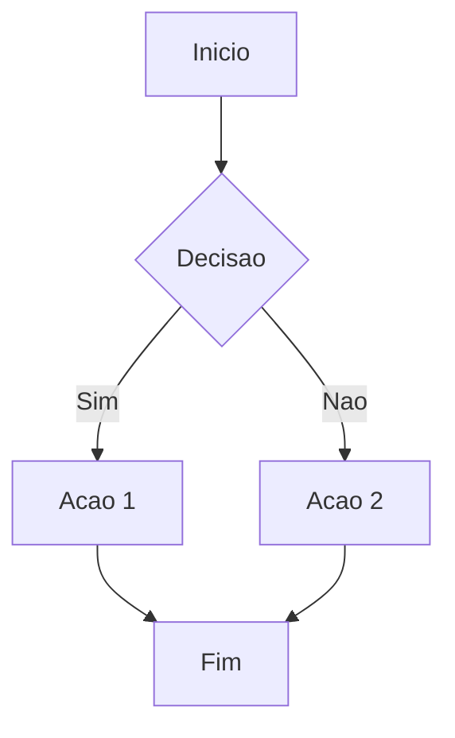
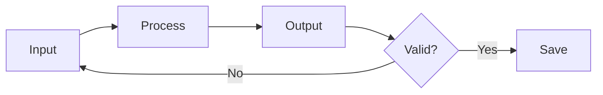
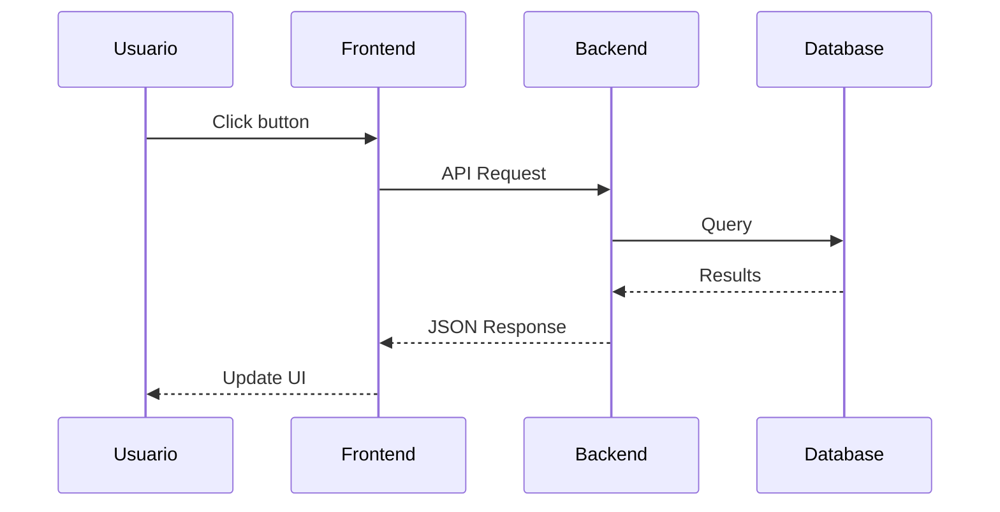
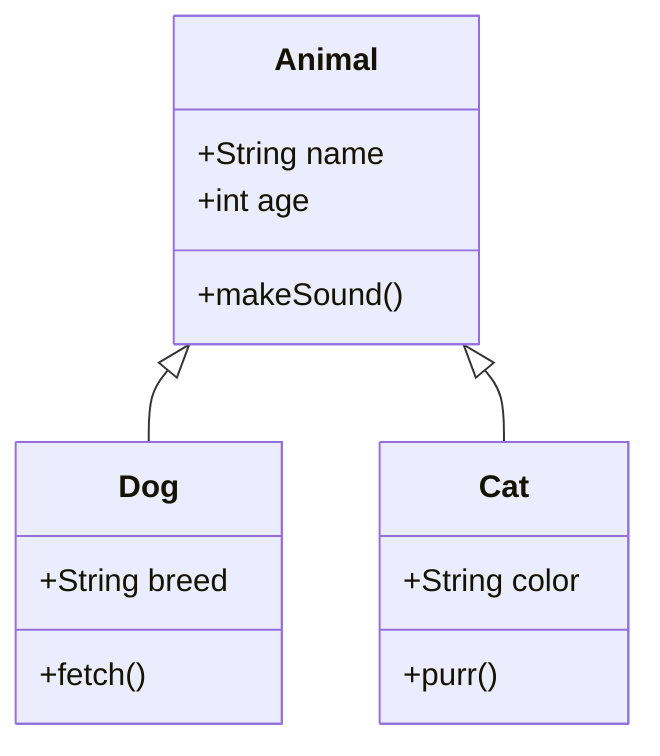
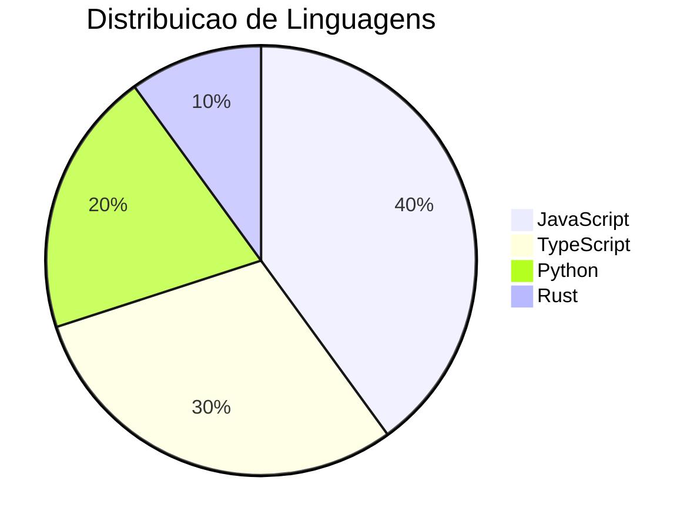
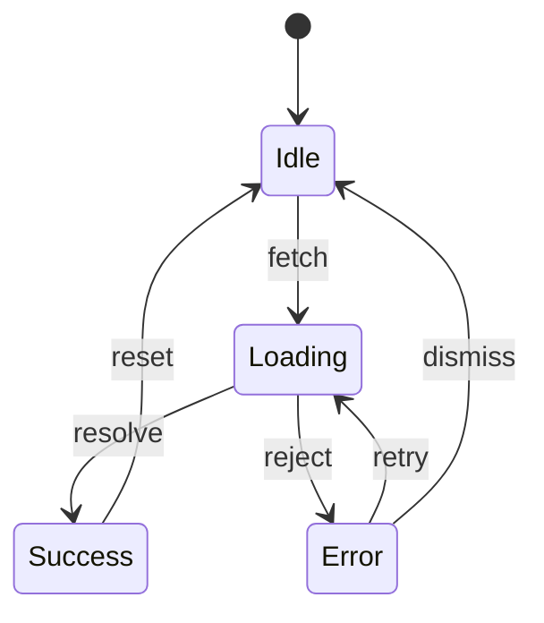

# Teste: Diagramas Mermaid

%%
COMO TESTAR:
- Verifique que diagramas sao renderizados como SVG
- Header deve mostrar "mermaid"
- Mova cursor para dentro e verifique que source aparece
- Teste diferentes tipos de diagrama
%%

## 1. Flowchart (graph TD)



%%
ESPERADO:
- Diagrama de fluxo renderizado como SVG
- Nos com formas diferentes (retangulo, losango)
- Setas com labels
- Header com "mermaid"
%%

## 2. Flowchart (graph LR)



%%
ESPERADO:
- Fluxo da esquerda para a direita (horizontal)
%%

## 3. Sequence Diagram



%%
ESPERADO:
- Diagrama de sequencia com participantes no topo
- Setas entre participantes
- Labels nas setas
%%

## 4. Class Diagram



%%
ESPERADO:
- Diagrama de classes com caixas
- Atributos e metodos listados
- Setas de heranca
%%

## 5. Pie Chart



%%
ESPERADO:
- Grafico de pizza com fatias proporcionais
- Titulo visivel
- Cores distintas por fatia
%%

## 6. State Diagram



%%
ESPERADO:
- Diagrama de estados com transicoes
- Estado inicial marcado com [*]
%%

## 7. Mermaid com Erro de Sintaxe

```mermaid
graph TD
    A --> B --> C
    invalid syntax here %%%
```

%%
ESPERADO:
- Erro visivel em vermelho (mensagem de erro do Mermaid)
- NAO deve crashar o editor
%%

## 8. Mermaid Vazio

```mermaid
```

%%
ESPERADO:
- Verificar comportamento com bloco mermaid vazio
%%
