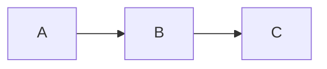

# Teste: Combinacoes Complexas e Stress Test

%%
COMO TESTAR:
- Este arquivo combina multiplos features em contextos complexos
- Verifique que cada feature funciona corretamente mesmo quando combinado com outros
- Verifique performance (sem lag ao mover cursor)
- Verifique que nao ha conflitos entre plugins
%%

## 1. Formatacao Inline Combinada em Texto Denso

Este paragrafo tem **negrito**, *italico*, ***negrito-italico***, ~~tachado~~, `codigo`, ==highlight==, [link](https://example.com), [[wikilink]], e nota^[inline footnote] tudo na mesma frase. Mais texto aqui com $E=mc^2$ formula inline e outra [[nota|com display text]] e finalmente um block ref. ^stress-001

%%
ESPERADO:
- CADA feature deve funcionar independentemente
- Mover cursor sobre qualquer elemento revela apenas os marcadores DAQUELE elemento
- Performance deve ser aceitavel (sem lag perceptivel)
%%

## 2. Lista com Formatacao Rica

- **Item negrito** com *italico* e `codigo`
- Item com [link externo](https://example.com) e [[wikilink interno]]
- Item com ==highlight== e ~~tachado~~
- Item com formula $x^2 + y^2 = z^2$
- [x] Task completa com **negrito**
- [ ] Task pendente com [[link para nota]]
  - Sub-item com `codigo` e *italico*
    - Sub-sub com ==highlight==
      1. Ordenada nivel 4 com **negrito**

%%
ESPERADO:
- Todos os niveis de aninhamento devem funcionar
- Formatacao inline em cada nivel deve ser independente
- Checkboxes devem ser interativos mesmo com formatacao
%%

## 3. Blockquote com Callout e Formatacao

> Blockquote normal com **negrito** e [link](https://example.com).

> [!tip] Dica com Formatacao
> Este callout tem **negrito**, *italico* e `codigo`.
> E tambem tem [[wikilinks]] e ==highlight==.
> - Lista dentro do callout
> - [x] Task dentro do callout
> - Outro item com $formula$

> [!warning]- Callout Dobravel com Conteudo Rico
> Este callout comeca colapsado.
> Tem **formatacao** completa.
>
> > Blockquote dentro de callout (aninhamento duplo).

%%
ESPERADO:
- Blockquote e callout devem ser distinguidos corretamente
- Formatacao inline funciona dentro de ambos
- Lista e task dentro de callout devem funcionar
- Callout dobravel deve expandir/colapsar com todo conteudo
%%

## 4. Tabela com Conteudo Complexo

| Feature | Exemplo | Status |
|---------|---------|--------|
| **Negrito** | Texto **bold** | `INPUT[inlineSelect(ok, falha):status]` |
| *Italico* | Texto *italic* | Testado |
| `Codigo` | `inline code` | ~~Removido~~ |
| [Link](https://example.com) | [[Wikilink]] | ==Highlight== |
| $Math$ | $x^2$ | Nota[^tab] |

[^tab]: Nota de rodape referenciada na tabela.

%%
ESPERADO:
- Toda formatacao inline dentro de celulas
- Meta-bind select funcional dentro da tabela
- Footnote referenciada na tabela deve funcionar
%%

## 5. Heading com Todos os Tipos de Formatacao

## Heading com **negrito** e *italico* e `codigo` e ~~tachado~~

### Heading com [link](https://example.com) e [[wikilink]]

#### Heading com ==highlight== e $formula$

%%
ESPERADO:
- Headings devem suportar toda formatacao inline
- Marcadores # devem ser independentes dos marcadores inline
%%

## 6. Codigo Dentro de Contextos Variados

Inline: `const x = 42;`

> Dentro de blockquote: `const y = 100;`

- Dentro de lista: `const z = 200;`

> [!note] Dentro de Callout
> Codigo: `const w = 300;`

%%
ESPERADO:
- Codigo inline deve ter mesmo estilo visual em todos os contextos
- Background + monospace + border-radius consistente
%%

## 7. Links em Todos os Contextos

Paragrafo: [link](https://example.com) e [[wikilink]] e https://bare-url.com

> Blockquote: [link](https://example.com) e [[wikilink]]

- Lista: [link](https://example.com) e [[wikilink]]

> [!tip] Callout com [link](https://example.com) e [[wikilink]]
> Conteudo do callout.

| Contexto | Link |
|----------|------|
| Tabela | [link](https://example.com) |

%%
ESPERADO:
- Links devem funcionar em todos os contextos
- Cmd+Click deve abrir em todos os contextos
%%

## 8. Multiplos Blocos em Sequencia

```js
const a = 1;
```

```python
b = 2
```

```rust
let c = 3;
```

---

$$
x = \frac{-b \pm \sqrt{b^2 - 4ac}}{2a}
$$

---



%%
ESPERADO:
- Blocos consecutivos devem ser independentes
- Linhas horizontais entre blocos devem funcionar
- Cada bloco com seu proprio widget
%%

## 9. Comentarios em Contextos Variados

Texto %%comentario oculto%% visivel.

- Lista com %%comentario%% item

> Blockquote com %%comentario%% texto

%%
Este bloco de comentario esta entre
dois elementos de teste.
%%

Mais texto apos bloco de comentario.

%%
ESPERADO:
- Comentarios ocultos em todos os contextos
- Fluxo de texto nao afetado pelos comentarios ocultos
%%

## 10. Stress Test de Performance

**a** *b* **c** *d* **e** *f* **g** *h* **i** *j*
`1` `2` `3` `4` `5` `6` `7` `8` `9` `10`
==x== ==y== ==z== ==w== ==v== ==u== ==t== ==s== ==r== ==q==
~~a~~ ~~b~~ ~~c~~ ~~d~~ ~~e~~ ~~f~~ ~~g~~ ~~h~~ ~~i~~ ~~j~~
[a](https://a.com) [b](https://b.com) [c](https://c.com) [d](https://d.com)
[[nota1]] [[nota2]] [[nota3]] [[nota4]] [[nota5]]
$a$ $b$ $c$ $d$ $e$ $f$ $g$ $h$ $i$ $j$

%%
ESPERADO:
- Muitos elementos inline na mesma pagina
- Performance deve ser aceitavel: sem lag ao scrollar ou mover cursor
- Cada elemento ainda deve funcionar individualmente
%%

## 11. Embeds Multiplos

![[nota-para-embed]]

![[outra-nota-embed#Secao]]

![[imagem-teste.png|400]]

%%
ESPERADO:
- Multiplos embeds na mesma pagina
- Cada embed carrega independentemente
- Loading states individuais
%%

## 12. Documento Longo com Scroll

%%
ESPERADO ao scrollar:
- visibleRanges deve limitar decoracoes ao viewport
- Performance constante independente do tamanho do documento
- Decoracoes reconstruidas ao scrollar para novas areas
%%

Lorem ipsum dolor sit amet, consectetur adipiscing elit.

Sed do eiusmod tempor incididunt ut labore et dolore magna aliqua.

Ut enim ad minim veniam, quis nostrud exercitation ullamco laboris.

Duis aute irure dolor in reprehenderit in voluptate velit esse cillum.

Excepteur sint occaecat cupidatat non proident, sunt in culpa qui officia.

Lorem ipsum dolor sit amet, consectetur adipiscing elit.

Sed do eiusmod tempor incididunt ut labore et dolore magna aliqua.

Ut enim ad minim veniam, quis nostrud exercitation ullamco laboris.

Duis aute irure dolor in reprehenderit in voluptate velit esse cillum.

Excepteur sint occaecat cupidatat non proident, sunt in culpa qui officia.

---

Fim do teste de stress. Se voce chegou ate aqui sem bugs, o editor esta solido!
